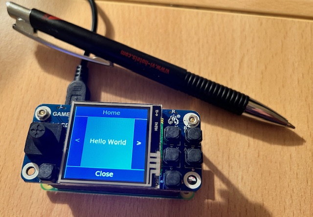

# Spotpear Raspberry Pi 1.54inch Game LCD 

Set up a 1.54inch Game LCD Display (ST7789V) with a XPT2046 touch controller mounted on Raspberry Zero 2W. 
Tested with Raspberry Pi OS Bullseye Lite.
This page shows how display drivers are installed for using touchpi.<br>
<ins>We accept no liability for any problems that may arise when following this procedure.</ins>



/// note
The display driver installs a second framebuffer for the SPI LCD screen in addition to the standard HDMI screen.
Then the content is mirrored from the first to the second using a fbcp tool. 
However, the developers of these tools recommend no longer using them. 
Therefore, in this setup, the framebuffer of the LCD screen is addressed directly via the X11 fbturbo driver. 
The console terminal is using directly the framebuffer of the LCD screen with fbcon in cmdline.txt.
This setup therefore deviates from the manufacturer's description.
///

## Install Image
It is a good idea to save some system files after installation and first boot of the Raspberry Pi OS Bullseye Lite image. 
Image installation is described here: [Installation](../../index.md#install).

/// details | Origin /boot/cmdline.txt 
```
--8<-- "./docs/displays/1.54inch_Game_LCD/cmdline.txt"
```
///

/// details | Origin /boot/config.txt 
``` linenums="1"
--8<-- "./docs/displays/1.54inch_Game_LCD/config.txt"
```
///

``` title="Update OS with"
sudo apt update && sudo apt upgrade --yes
sudo apt install --yes --no-install-recommends git xorg xserver-xorg-video-fbturbo x11-apps xinput-calibrator
```
/// note
The Game LCD display driver can use fbturbo. Therefore, the package xorg-video-fbturbo is installed, and you have to
configure later an appropriate 99-fbturbo.conf file.
///

## Install Display Driver

Download with wget and copy display driver to /boot/overlays/  
Display documentation at: [Spotpear - Raspberry Pi 1.54inch Game LCD User Guide](https://spotpear.com/index/study/detail/id/65.html)

```
mkdir display
cd display/
wget https://cdn.static.spotpear.com/uploads/download/diver/gm154/lcd154.dtbo
sudo cp lcd154.dtbo /boot/overlays/
```

Changes in /boot/config.txt with
```
sudo nano /boot/config.txt
```
Uncomment in the section # Enable DRM VC4 V3D driver
``` linenums="61"
--8<-- "./docs/displays/1.54inch_Game_LCD/config.changed.txt:61:63"
```
Add this lines to the end of the file
``` linenums="81"
--8<-- "./docs/displays/1.54inch_Game_LCD/config.changed.txt:81:90"
```

/// details | Changed /boot/config.txt 
``` linenums="1"  hl_lines="62 63 81 82 83 84 85 86 87 88 89 90"
--8<-- "./docs/displays/1.54inch_Game_LCD/config.changed.txt"
```
///

Changes in /boot/cmdline.txt with
```
sudo nano /boot/cmdline.txt
```
add `fbcon=map:10 fbcon=font:ProFont6x11` to the end of the line.
This will define the framebuffer /dev/fb1 of the SPI display as main display for the consoles. 

/// details | Changed /boot/cmdline.txt 
```
--8<-- "./docs/displays/1.54inch_Game_LCD/cmdline.changed.txt"
```
///

Reboot 
```
sudo reboot
```
After reboot the display should show the boot process.

## Create X11 file
Run `fbset -i` and get the name of the frame buffer device. 
You can use the name as identifier in your conf file. 

Create the file 99-fbturbo.conf with `sudo nano /usr/share/X11/xorg.conf.d/99-fbturbo.conf` and add this lines:

/// note | /usr/share/X11/xorg.conf.d/99-fbturbo.conf
``` linenums="1" hl_lines="12 25"
--8<-- "./docs/displays/1.54inch_Game_LCD/99-fbturbo.conf"
```
///

## Rotation (screen and touch)
You can rotate the touch display with changes in the `boot/config.txt` and `/usr/share/X11/xorg.conf.d/40-libinput.conf` file.
Edit with `sudo nano`.

| /boot/config.txt                                                    | /usr/share/X11/xorg.conf.d/40-libinput.conf                                                        |
|---------------------------------------------------------------------|----------------------------------------------------------------------------------------------------|
| `dtoverlay=lcd154:rotate=0`<br>(USB right)                          | `Option "TransformationMatrix" "1 0 0 0 1 0 0 0 1"`<br>Option is optional. Not needed in the file. |
| `dtoverlay=lcd154:rotate=90`<br>(USB down)                          | Use TransformationMatrix 90 -><br>`Option "TransformationMatrix" "0 -1 1 1 0 0 0 0 1"`             |                               
| `dtoverlay=lcd154:rotate=180`<br>(USB left)                         | Use TransformationMatrix 180 -><br>`Option "TransformationMatrix" "-1 0 1 0 -1 1 0 0 1"`           |
| `dtoverlay=lcd154:rotate=270`<br>(USB on top <br> preferred layout) | Use TransformationMatrix 270 -><br>`Option "TransformationMatrix" "0 1 0 -1 0 1 0 0 1"`            |

/// details | Origin /usr/share/X11/xorg.conf.d/40-libinput.conf
``` linenums="1"
--8<-- "./docs/displays/1.54inch_Game_LCD/40-libinput.conf"
```
///

/// details | Changed /usr/share/X11/xorg.conf.d/40-libinput.conf 
``` linenums="1"  hl_lines="43"
--8<-- "./docs/displays/1.54inch_Game_LCD/40-libinput.changed.conf"
```
///

## Adjust touch dimension

Scale the touch dimension if the cursor does not reach the edges [Read more here](../../tips/rotation.md).

/// details | Sample of a final /usr/share/X11/xorg.conf.d/40-libinput.conf 
``` linenums="1"  hl_lines="43"
--8<-- "./docs/displays/1.54inch_Game_LCD/40-libinput.final.conf"
```
///


When the cursor reaches the edges you can finally calibrate the touch input. 

Run X window server in background
```
sudo -b /usr/lib/xorg/Xorg :0
```
Run xinput_calibrator
```
DISPLAY=:0.0 xinput_calibrator -v --output-type xorg.conf.d
```
Do a calibration

Create the file 99-calibration.conf with 
```
sudo nano /usr/share/X11/xorg.conf.d/99-calibration.conf
``` 

Copy the section from stdout to the file.

The file will look like this (probably with other values):
/// note | /usr/share/X11/xorg.conf.d/99-calibration.conf
``` linenums="1"
--8<-- "./docs/displays/1.54inch_Game_LCD/99-calibration.init.conf"
```
///

Restart X window server and test with calling e.g. `DISPLAY=:0.0 xcalc`


