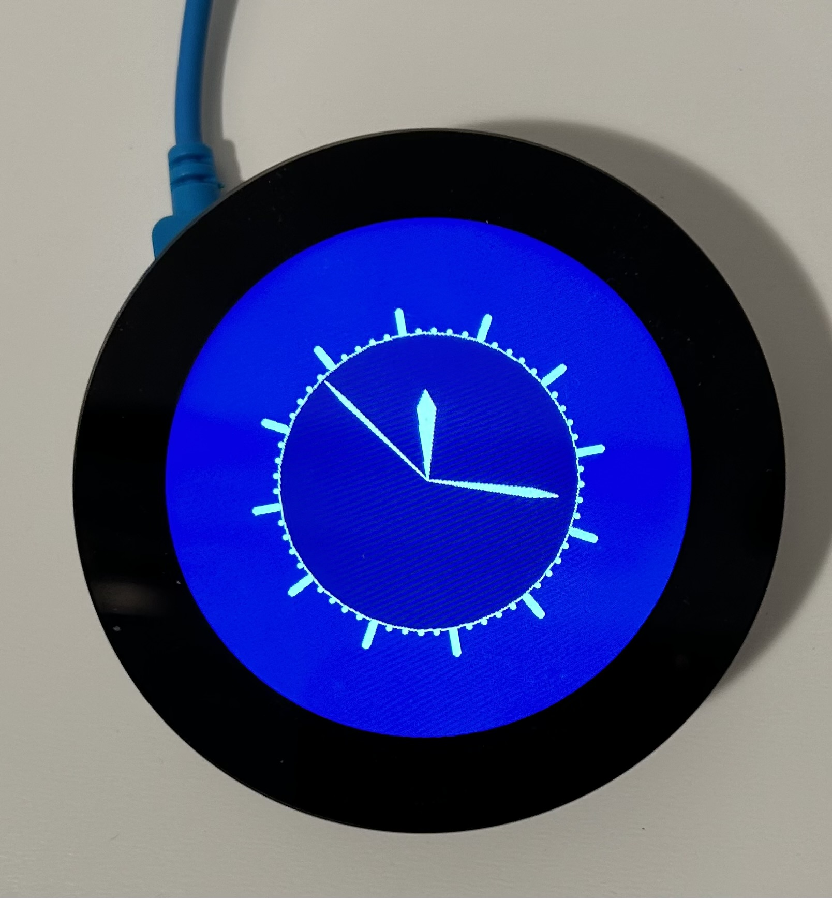
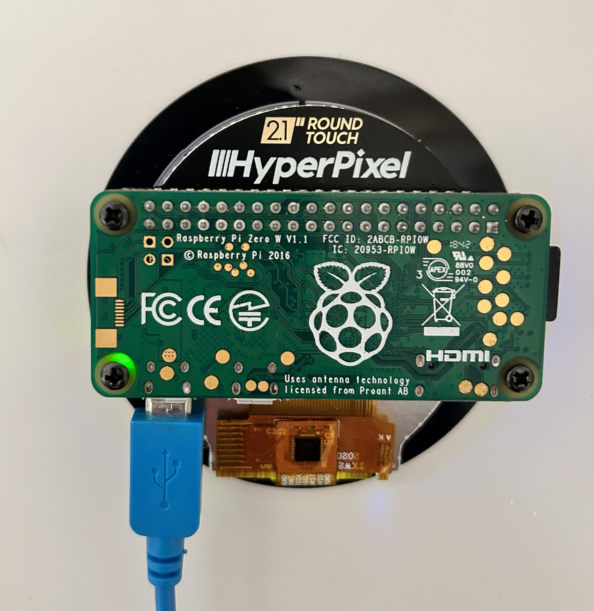

# Hyperpixel 2.1 Round Touch Display 

Setup a Hyperpixel 2.1 Round Display with touch controller mounted on a Raspberry Zero or Raspberry Zero 2.
This page shows how display drivers are installed for using touchpi.<br>
<ins>We accept no liability for any problems that may arise when following this procedure.</ins>

/// note
Pimoroni states that the installation is best done with Raspberry OS Buster. 
However, the end of support is already in June 2024, but the installation routine has worked on all Raspberry OS versions so far. 
On Bullseye and Bookworm, the /boot/config.txt file still needs to be adjusted a little bit. 
The rotation script hyperpixel2r-rotate does not work with a Buster lite installation and generally not on Bullseye or Bookworm. 
However, the screen rotation can be set manually so that the screen can also be used with touchpi.
///




## Install Image
It is a good idea to save some system files after installation and first boot. 
Image installation is described here: [Installation](../../index.md#install).
First boot can last several minutes until the device gets an IP from your DHCP Server (sometime the initial boot can hang. 
In this rare cases just disconnect from power and try again. Or burn image again).
login with an ssh terminal (e.g. putty) and your user after the device is available in your LAN 
(if ssh is used don’t forget to add your ssh private key in the ssh terminal configuration).

## Update OS

```
sudo apt update && sudo apt upgrade --yes
sudo apt install --yes --no-install-recommends git xorg x11-apps xinput-calibrator
sudo apt autoremove --yes
```
/// note
This can last up to 15 minutes for a pi zero and a buster os
///

## Install Display Driver

Install Driver: 

`git clone https://github.com/pimoroni/hyperpixel2r`

`cd hyperpixel2r`

`sudo ./install.sh`

Display documentation: [Github pimoroni/hyperpixel2r](https://github.com/pimoroni/hyperpixel2r).

## Changes in /boot/config.txt

`sudo nano /boot/config.txt`

add the line `display_rotate=0` at the end of the file.

Uncomment other dtoverlay driver like `dtoverlay=vc4-kms-v3d`, if not allready uncommented.

Uncomment these config entries (existence is dependend of the Raspberry OS version):  `max_framebuffers` , `display_auto_detect` , `disable_fw_kms_setup`


/// details | /boot/cmdline.txt of a Raspberry OS Buster
```
--8<-- "./docs/displays/hyperpixel2.1.round/config.changed_buster.txt"
```
///

/// details | /boot/cmdline.txt of a Raspberry OS Bookworm
```
--8<-- "./docs/displays/hyperpixel2.1.round/config.changed_bookworm.txt"
```
///
Reboot with `sudo shutdown -r` now or simply `sudo reboot`

## Rotation (screen and touch)

Manufacturer script `hyperpixel2r-rotate` does not work with Buster lite or any Bullseye or any Bookworm. 
For rotation change the `/boot/config.txt` file and the `/usr/share/X11/xorg.conf.d/40-libinput.conf` file manually.

Edit with `sudo nano`.

| /boot/config.txt                                           | /usr/share/X11/xorg.conf.d/40-libinput.conf                                                        |
|------------------------------------------------------------|----------------------------------------------------------------------------------------------------|
| `display_rotate=0`<br>USB on bottom<br>Option is optional. | `Option "TransformationMatrix" "1 0 0 0 1 0 0 0 1"`<br>Option is optional. Not needed in the file. |
| 90° (left): `display_rotate=1`<br>USB on the right side    | Use TransformationMatrix 90 -><br>`Option "TransformationMatrix" "0 1 0 -1 0 1 0 0 1"`             |                               
| 180° (upside down):  `display_rotate=2`<br>USB on top      | Use TransformationMatrix 180 -><br>`Option "TransformationMatrix" "-1 0 1 0 -1 1 0 0 1"`           |
| 90° (right): `display_rotate=3`<br>USB on the left side    | Use TransformationMatrix 270 -><br>`Option "TransformationMatrix" "0 -1 1 1 0 0 0 0 1"`            |

The `/usr/share/X11/xorg.conf.d/40-libinput.conf` file can look like this example with a 90° rotation of the touch input

/// details | Changed /usr/share/X11/xorg.conf.d/40-libinput.conf 
``` linenums="1"  hl_lines="43"
--8<-- "./docs/displays/waveshare3.5a/40-libinput.changed.conf"
```
///

Read more about offsets, scaling and rotation [here](../../tips/rotation.md).

## Test X window server

run X window server in background:

`sudo -b /usr/lib/xorg/Xorg :0`

Run xcalc with `DISPLAY=:0.0 xcalc -geometry 340x340-70+70`

A calculator should be displayed and touch events should work.