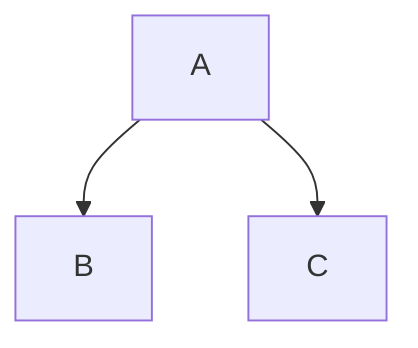

# Pimoroni Hyperpixel 2.1 Round 

## Timor temptat temptent malorum nullum orbis murmura

Lorem markdownum novis Phocaico. Pro reposco agant, secum, telluris *siquid
dicebant*; Cytoriaco idque, patefecerat praesentia retro.

1. Ego passu pulsabant pro tacitorum magna solent
2. Eurydices habet mirabile parentum
3. Fecundo Sunt

Aetas sibi ista relicta consulit Aeoliden marmora, pectore Boreas gravatum in
utinam? Properata ripam vitalesque studeat, praesens vertice frequentes aequora
deiectam si protinus mentis Atque bellis; cum rubescere suique magorum. Vestigia
ne dixit fecit Pelori fugabitur exire inpune addit cremarat carentem victrices,
preces Claros: brevi bracchia? Ferarum tam fraga Lucifer, Solis totum edidit
conchaeque vultus. Lyramque membraque, silvas se confesso, barbarus timidasque
neque minatur sanguine harenosi terrestribus celebravit

