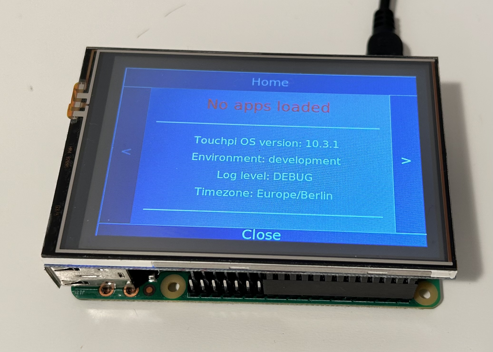

# Waveshare 3.5inch RPi Display(a) 

Set up a Waveshare 3.5inch RPi Display with a XPT2046 touch controller mounted on a Raspberry 3B. 
Tested with Raspberry Pi OS Bullseye Lite.
This page shows how display drivers are installed for using touchpi.<br>
<ins>We accept no liability for any problems that may arise when following this procedure.</ins>



/// note
The driver installation with the supplied LCD-show script overwrites the system files. 
This can lead to conflicts with Raspberry installation updates.
The script-controlled driver installation does not harmonize with a Raspberry OS lite.
That is why we did not use the installation script and only carried out the most necessary steps manually (described on this page).
The display has no hardware support for backlight control. So the  display consumes power in screensaver mode. 
But therefore it is a relatively cheap display. 
There seem to be several clones of this display with different installation procedures.
///

## Install Image
It is a good idea to save some system files after installation and first boot of the Raspberry Pi OS Bullseye Lite image. 
Image installation is described here: [Installation](../../index.md#install).

/// details | Origin /boot/cmdline.txt 
```
--8<-- "./docs/displays/waveshare3.5a/cmdline.txt"
```
///

/// details | Origin /boot/config.txt 
``` linenums="1"
--8<-- "./docs/displays/waveshare3.5a/config.txt"
```
///

``` title="Update OS with"
sudo apt update && sudo apt upgrade --yes
sudo apt install --yes --no-install-recommends git xorg xserver-xorg-video-fbturbo x11-apps xinput-calibrator
```
/// note
The waveshare display driver can use fbturbo. Therefore, the package xorg-video-fbturbo is installed, and you have to
configure an appropriate 99-fbturbo.conf file.
///

## Install Display Driver

Download with git clone and copy display driver to /boot/overlays/  
Display documentation at: [3.5inch_RPi_LCD_(A) - Waveshare Wiki](https://www.waveshare.com/wiki/3.5inch_RPi_LCD_(A))

```
git clone https://github.com/waveshare/LCD-show.git
cd LCD-show/
sudo cp ./waveshare35a-overlay.dtb /boot/overlays/waveshare35a.dtbo
sudo cp ./waveshare35a-overlay.dtb /boot/overlays/ 
```

Changes in /boot/config.txt with
```
sudo nano /boot/config.txt
```
Uncomment in the section # Enable DRM VC4 V3D driver
``` linenums="61"
--8<-- "./docs/displays/waveshare3.5a/config.changed.txt:61:63"
```
Add this lines to the end of the file
``` linenums="81"
--8<-- "./docs/displays/waveshare3.5a/config.changed.txt:81:86"
```

/// details | Changed /boot/config.txt 
``` linenums="1"  hl_lines="62 63 81 82 83 84 85 86"
--8<-- "./docs/displays/waveshare3.5a/config.changed.txt"
```
///

Changes in /boot/cmdline.txt with
```
sudo nano /boot/cmdline.txt
```
add `fbcon=map:10 fbcon=font:ProFont6x11` to the end of the line.
This will define the framebuffer /dev/fb1 of the SPI display as main display for the consoles.

/// details | Changed /boot/cmdline.txt 
```
--8<-- "./docs/displays/waveshare3.5a/cmdline.changed.txt"
```
///

Reboot 
```
sudo reboot
```
After reboot the display should show the boot process.

## Create X11 file
Create the file 99-fbturbo.conf with `sudo nano /usr/share/X11/xorg.conf.d/99-fbturbo.conf` and add this lines:

/// note | /usr/share/X11/xorg.conf.d/99-fbturbo.conf
``` linenums="1"
--8<-- "./docs/displays/waveshare3.5a/99-fbturbo.conf"
```
///

## Rotation (screen and touch)
You can rotate the touch display with changes in the `boot/config.txt` and `/usr/share/X11/xorg.conf.d/40-libinput.conf` file.
Edit with `sudo nano`.

| /boot/config.txt                                                                        | /usr/share/X11/xorg.conf.d/40-libinput.conf                                                        |
|-----------------------------------------------------------------------------------------|----------------------------------------------------------------------------------------------------|
| `dtoverlay=waveshare35a:rotate=0`<br>(USB on top, book form layout)                     | `Option "TransformationMatrix" "1 0 0 0 1 0 0 0 1"`<br>Option is optional. Not needed in the file. |
| `dtoverlay=waveshare35a:rotate=90`<br>(USB right, power cable down)                     | Use TransformationMatrix -><br>`Option "TransformationMatrix" "0 -1 1 1 0 0 0 0 1"`                |                               
| `dtoverlay=waveshare35a:rotate=180`<br>(USB down)                                       | Use TransformationMatrix -><br>`Option "TransformationMatrix" "-1 0 1 0 -1 1 0 0 1"`               |
| `dtoverlay=waveshare35a:rotate=270`<br>(USB left, power cable up <br> preferred layout) | Use TransformationMatrix -><br>`Option "TransformationMatrix" "0 1 0 -1 0 1 0 0 1"`                |

/// details | Origin /usr/share/X11/xorg.conf.d/40-libinput.conf
``` linenums="1"
--8<-- "./docs/displays/waveshare3.5a/40-libinput.conf"
```
///

/// details | Changed /usr/share/X11/xorg.conf.d/40-libinput.conf 
``` linenums="1"  hl_lines="43"
--8<-- "./docs/displays/waveshare3.5a/40-libinput.changed.conf"
```
///

## Adjust touch dimension

Scale the touch dimension if the cursor does not reach the edges [Read more here](../../tips/rotation.md).

/// details | Sample of a final /usr/share/X11/xorg.conf.d/40-libinput.conf 
``` linenums="1"  hl_lines="43"
--8<-- "./docs/displays/1.54inch_Game_LCD/40-libinput.final.conf"
```
///


When the cursor reaches the edges you can finally calibrate the touch input. 

Run X window server in background
```
sudo -b /usr/lib/xorg/Xorg :0
```
Run xinput_calibrator
```
DISPLAY=:0.0 xinput_calibrator -v --output-type xorg.conf.d
```
Do a calibration

Create the file 99-calibration.conf with 
```
sudo nano /usr/share/X11/xorg.conf.d/99-calibration.conf
``` 

Copy the section from stdout to the file.

The file will look like this (probably with other values):
/// note | /usr/share/X11/xorg.conf.d/99-calibration.conf
``` linenums="1"
--8<-- "./docs/displays/1.54inch_Game_LCD/99-calibration.init.conf"
```
///

Restart X window server and test with calling e.g. `DISPLAY=:0.0 xcalc`

## Implement HW backlight control.

There are some hacks how to implement a hardware backlight control for this display.  
[Adding brightness control for cheap LCD - Raspberry Pi Forums](https://forums.raspberrypi.com/viewtopic.php?t=149887)


